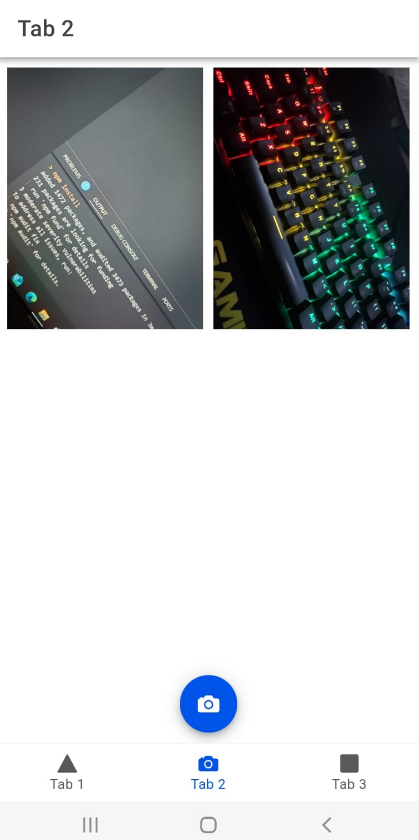
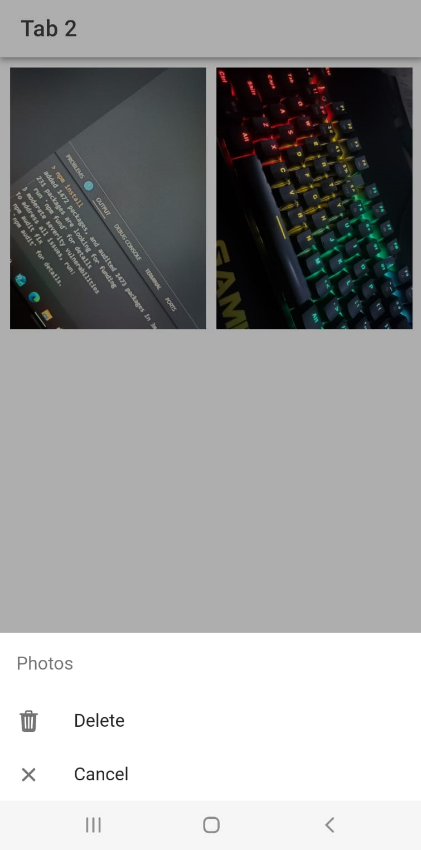

# GALERÍA CON FUNCIÓN DE ELIMINAR

# APK

CLIC PARA IR AL ENLACE DE DRIVE PARA DESCARGAR EL APK:

[APK GALERIA](https://drive.google.com/file/d/1Bd0G-OwNo2nqyWCf-7PUP_3_ZJw71_JN/view?usp=sharing)

# Integrantes

- Paúl Hidalgo
- [@Paulesh5](https://www.github.com/Paulesh5)
- Gilmar Morales
- [@Morales-Gilmar-Vladimir](https://www.github.com/Morales-Gilmar-Vladimir)
- Erick Ruiz
- [@Ruizerick26](https://www.github.com/Ruizerick26)

# How to Run

1. Instalar ionic en el computador mediante el comando: npm install -g @ionic/cli
2. Clonar el repositorio: https://github.com/Ruizerick26/galeria.git
3. En la terminal, entrar en el directorio del proyecto. En este caso: cd/galeria
4. Instalar los paquetes necesarios del proyecto mediante el comando: npm install
5. Ejecutar en pagina web con el comando: ionic serve
6. Para ejecutar en Android descargar el APK incluido en el repositorio e instalar en el dispositivo

# Conclusiones

1. Con la ayuda de Ionic, no es necesario tener que estar ejecutando la aplicación directamente en un celular, ya que con la ayuda del comando ionic serve, se pueden comprobar los cambios realizados, mostrando como se vería en el dispositivo.
2. Para poder generar el APK de la aplicación es de gran ayuda la herramienta de Android Studio, ya que, al ligar el proyecto, la herramienta automáticamente realiza los ajustes necesarios para generar un APK.
3. El trabajo de elaborar las diferentes imagenes de Splash-screem puede ser reducido con diversas herramientas, en este proyecto se utiliza el paquete Capacitor-resource mismo que al porporcionarle la imagen de icono y splash nos facilitara el generar cada tamaño necesario.
4. La aplicación desarrollada cumple con una funcionalidad suficiente además se agrego un apartado con información básica del equipo de trabajo.

## Icono

## Splash Screen

## Galeria

## Eliminar

